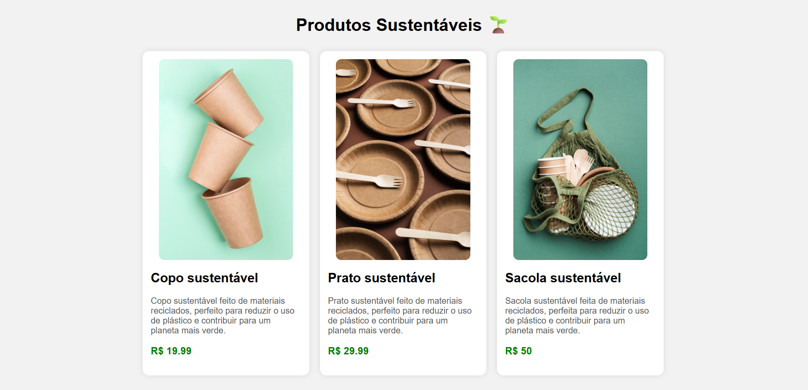

# API de Produtos Sustentáveis

Projeto desenvolvido com Node.js e Express para exibir uma lista de produtos sustentáveis e permitir o upload de imagens.
---
## Funcionalidades

- Página inicial da API
- Listagem de produtos sustentáveis
- Upload de imagens
- Armazenamento local das imagens
- Dados dos produtos em arquivo JSON
---
## Tecnologias utilizadas

- Node.js
- Express
- Multer
- JavaScript
- JSON
---

